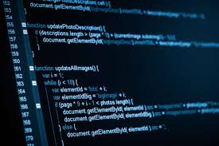

### Introduction
When I first starting learning how to program, every class that I took had different ways of keeping code tidy and neat. Some classes would enforce these rules, while others would simply not care; taking a "if it ain't broken, then don't fix it" approach. Progressing as a programmer has shown me that it is indeed important to have some kind of standard for writing code.

### Reasons why a coding standard is needed
Now that I think of it, a coding standard is something that I wish would've been more emphasized in ICS curriculum. As mentioned above, the focus on writing clean and neat code was sporadic for different classes which makes learning how to write code and visiting completely new concepts kind of difficult. By having some kind of coding standard, teachers and professors are able to progress healthy habits for the industry as well; nobody wants a programmer on their team that can't write readable code.

I have always found it useful to have some kind of standard when writing my own code so that it could be readable to not only the professor or TA that was grading it, but so that classmates and peers could read it and collaborate with me. Being somewhat of a grammar geek, nothing infuriates me more than improperly formatted indentation in code. An example of this is shown below:

```
function test() {
let i = 0;

while (i < 100) {
console.log("pls reformat me");
}

return 0;
}
```

Obviously, this is a very simple example of bad code (it could be way worse). I recently adopted my coding standard from my ICS 212 C/C++ class, that would reformat the above code to something like this:

```
function test() {

  let i = 0;
  
  while (i < 100) {
  
    console.log("reformatted!");
  
  }
  
  return 0;
  
}
```

Although it's a few lines longer than the original code, it's 100 times more readable and much easier to follow, especially in a case where there are more than just 10 lines of code.

While using ESLint with IntelliJ, it can get a little bit frustrating when it tells you some spaces could be removed or that a function needs to have a better name, but I think that these little nitpicky things are needed. I like to think of ESLint as my future supervisor; of course they want the best code because they want to be able to read it for themselves and have your coworkers work off of it as well. In this way, ESLint is a necessary evil; most people probably do not care for it, but know that it is good to have code checked off using it.
