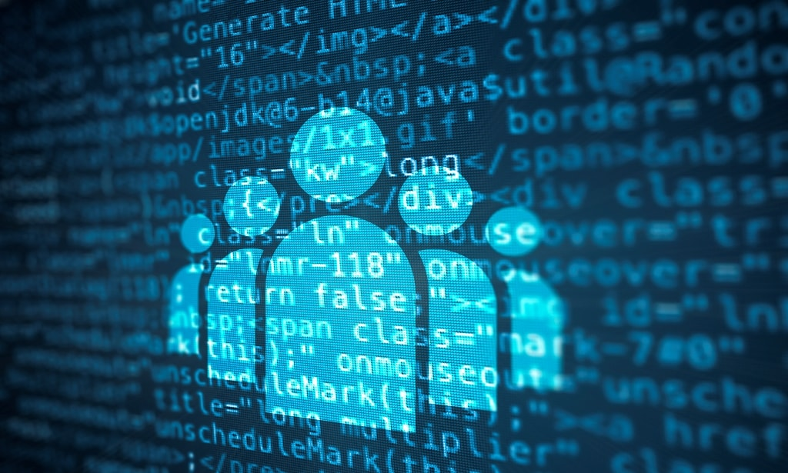

### A Preface
In this day and age, it's easy to get left behind. I'll elaborate; ever since computers became mainstream and now everybody has one that fits in the palm of their hand, many people take for granted just how simple developers and engineers are able to make computers and smartphones look. Being a computer science student has drastically changed my perspective on computers. I'm no longer an average citizen; I can understand the amount of complexity that is going on behind the scenes even during "mediocre" tasks, such as refreshing a web page. I know that your computer beacons out to some server that hosts that webpage and that server will respond to your computer within milliseconds with millions of bytes of data. A computer does much more than the average person could ever imagine it to do which is partly incredible but also partly scary. Many people are not "in the know" about these sorts of things, and are very susceptible to cyberattacks and compromised data in the future. Most people are simply just not technologically literate to handle these sorts of concepts. These types of people get left behind.

It is my duty as a computer science student to educate and help these people for the betterment of the world. The technological revolution is in full effect; technology is being developed at incredible rates. I know I still have a lot to learn. But learning is my passion and being the best I can be at something is my goal.

### The Future
Coming into ICS 314 (Software Engineering) is a major milestone. To me, it is the separation between a novice and intermediate developer. Moving forward, I'd like to see how I progress as a developer and in what direction. As it is, I have found myself developing simple shell scripts using my knowledge from programming classes. Software engineering, however, is where I want to push myself even further. Working with a team on software projects and working out solutions is of utmost interest for me. I hope to develop healthy working environments with the people I collaborate with and perhaps in the future, collaborate with them outside of school on bigger projects. 
