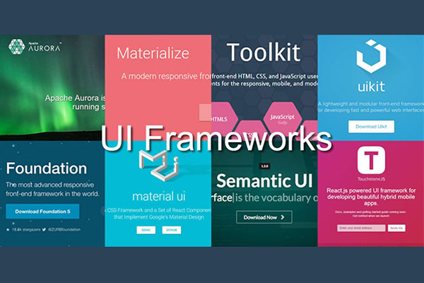

### Why bother using a framework?
Semantic UI is one of many frameworks that web designers can use for their websites. The whole purpose of it is to simplify HTML/CSS code, and it does just that. In essence, the whole Semantic UI framework seems to give shortcuts to the infinitely many combinations that can be made with raw HTML/CSS. This narrows down possible implementations of HTML/CSS code and thus will make it easier for the developer to work with.
Personally, I think that using a UI framework is highly beneficial to a web developer. For example, in the first exercises with HTML/CSS coding in ICS 314, I had to implement columns in a web page without using a UI framework. Not only was it not easy to work with, but the webpage itself looked terrible compared to modern webpages. I could see that this method of implementing HTML code would not be sustainable in large websites because of all the nitty-gritty details you would have to get into with raw HTML/CSS code. 
Using Semantic UI and creating the first web page with that was a world of difference. Semantic UI made it so all I had to do was specify the different class names that they have for certain things (like menu bars, grid containers, etc.) and the framework speaks for itself. Compare the two pictures and I'm sure it can be easily told as to which one was made with the Semantic UI framework:

### Preferences
Despite the advantages that Semantic UI and other UI frameworks bring, I suppose it all boils down to preference when it comes to using them. Take, for example, a Unix power user. Every one has their preferences for text editors; some prefer nano, others pico, and some like vi. At the end of the day, it all just depends on how they are able to get the most amount of work done in the least amount of time being comfortable with whatever they use to finish that work. The same principle applies for UI frameworks I suppose. Some people probably hate them in fact!

### Conclusion
In conclusion, I think that I will be using Semantic UI and probably will explore other frameworks in the future as a web developer. For me, I think that they simplify a lot of the work to be done with raw HTML/CSS code that you won't really find too much with other programming languages. Whether or not you choose to use it is all summed up to if you are able to comfortably use it personally.
