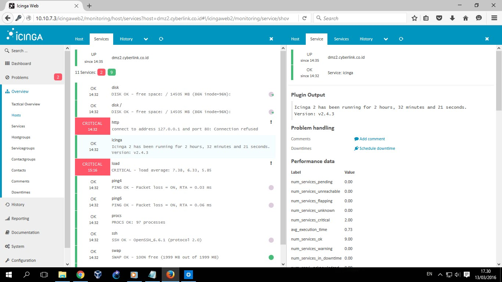
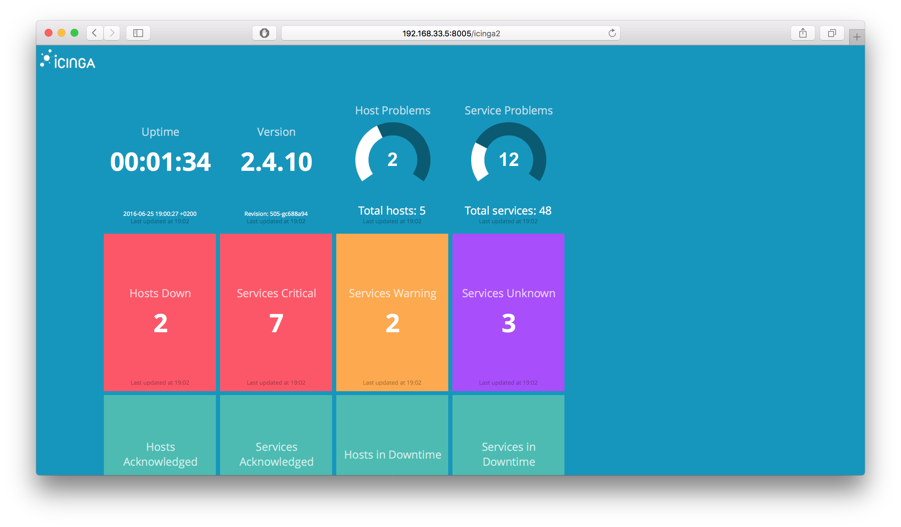

Icinga2 is an open source network monitoring software. Being open source makes it much cheaper to implement than its commercial competitors (AlienVault, Splunk, etc.) which is why my company went that route in the first place. At first, it was very difficult for me to understand (being a complete "newbie" to networking and programming as a whole) but I have learned a lot and have the results to prove it, as I have been working on Icinga2 about two years now.

From most basic to more complex, I have configured the networking and firewall settings of the Cent OS 7 VMs that my Icinga2 instances are hosted on, installed all of the software necessary for the monitoring system (which includes things like MySQL, various plugins needed for device queries, Postfix, etc.), configured email alerting, programmed scripts in Bash for device queries, integrated Icinga2 with Grafana, a graphing software for graphing performance data, and the list goes on. At first, I didn't realize the immense amount of work that Icinga2 would take to understand and implement, but it has come to a point of realization that network monitoring is no easy task.

Below is an example of the Icinga2 web interface, something that I work with quite often (not my environment):

  

I've also integrated the web interface with a smaller, more concise dashboard interface using a software called Dashing (also not my environment):

  

Overall, I'd say working with Icinga2 has made me appreciate network monitoring and system administrator tasks, something that I would consider doing for a career.

Check out the Icinga2 website for more information: https://www.icinga.com/products/icinga-2/
