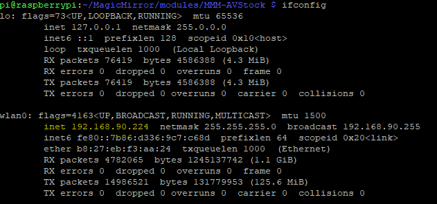

### Introduction
This guide will show you how to install the Magic Mirror software on a Raspberry Pi Zero W to make a useful dashboard which you can access from any computer in your house (or wherever you set this up). Use this guide in conjunction with my Youtube video.

Note: for this project, I wasn't able to run the MagicMirror site on the Pi Zero W connected to a monitor with the included Chromium browser as it ran too slow for my liking. Therefore, you'll need a separate computer to connect from to get to the MagicMirror site and it'll run much better. If you did, however, want to run the Pi connected to a monitor, just use a Raspberry Pi 3 or 4 (4 is kind of overkill) instead of the Pi Zero W, the instructions below will still apply.

### Parts Required
- A [Raspberry Pi Zero W](https://www.amazon.com/Raspberry-Pi-Zero-Wireless-model/dp/B06XFZC3BX/ref=sr_1_5?dchild=1&keywords=raspberry+pi+zero+w&qid=1589698278&sr=8-5) ($25)
- A [5.0V - 2.5A power supply](https://www.amazon.com/CanaKit-Raspberry-Supply-Adapter-Listed/dp/B00MARDJZ4/ref=sr_1_1?dchild=1&keywords=raspberry+pi+zero+w+power+supply&qid=1589698376&sr=8-1) (~$10)
  - **Note**: I bought a [Raspberry Pi Zero W Kit](https://www.amazon.com/gp/product/B0748MPQT4/) (~$28), which came with a case, heatsink, mini HDMI adapter, and other useful parts. This option will makes more sense than buying the parts separately because the price difference is miniscule between buying the board and this complete kit.
- An [SD card reader](https://www.amazon.com/gp/product/B07S6GGFB1/ref=ppx_yo_dt_b_search_asin_title?ie=UTF8&psc=1) (~18)
  - Note: You can get cheaper SD card readers but this one is useful for other things because it has additional USB ports.
- A monitor
- A separate computer

### Optional Parts
- Mini HDMI to HDMI adapter
  - This part is needed for the Raspberry Pi Zero in order to connect to a regular HDMI display so you can add the WiFi configuration via the desktop GUI. This part is not needed if you use add the WiFi configuration to the boot files on the SD card prior to boot up

### Software Required
- [SD Card Formatter](https://www.sdcard.org/downloads/formatter/)
  - For formatting your SD card
- [Etcher](https://www.balena.io/etcher/)
  - For installing the image on the SD card
- [Raspberry Pi Raspbian Buster with Desktop image](https://www.raspberrypi.org/downloads/raspbian/)
  - Note: I believe you can install MagicMirror with the Raspbian Buster Lite image, which I think would make it run a little bit faster, though I haven't tested this.
- [PuTTy](https://www.chiark.greenend.org.uk/~sgtatham/putty/)
  - An SSH client for connecting to the Pi
    - Note: If you're using a Mac, you can connect to the Pi using `ssh pi@<PiIPAddress>`

***

### Installation
1. Plug the SD card into your SD card reader
2. Format your SD card with SD Card Formatter
3. Flash the Raspberry Pi Raspbian Buster with Desktop image to your SD card with Etcher
  - *(Optional Step)* **If you don't have a Mini HDMI to HDMI adapter** or **if you don't want to configure the Pi via the desktop GUI** (i.e., a purely "headless" setup), you will want to add a couple of network configuration files to the `/boot` folder (accessible after you flash the image to the SD card) so that the Pi can connect to your network:
  - (1) `wpa_supplicant.conf` - the WiFi [network configuration file](../files/wpa_supplicant.conf)
  - (2) `ssh` - the SSH configuration file
    - This file can just be an empty file named `ssh`; it basically just tells the Pi that it should turn on the SSH configuration so that you can remotely connect to it
4. Plug in the SD card to the Raspberry Pi, connect it to a monitor, then power it on
  - Note: If you set up SSH, connect to the Pi via SSH (using PuTTy for Windows or Terminal for MacOS)

***

### Configuration
1. Configure basic settings
  - `sudo raspi-config`
    - **Change Localisation Options**
      - **Change Locale**
        - Select **en_US.UTF-8 UTF-8**
      - **Change timezone**
        - Select your timezone
      - **Change keyboard layout**
        - Select **US**
      - Change WiFi Country
        - Select **US**
    - (Optional) If you didn't upload the `ssh` on initial install, enable SSH in **Interface Options**
      - **Enable SSH**
2. (Optional) If you just enabled SSH access, connect to the Pi via SSH now.
  - To find the IP address to connect to, run `ifconfig` on the Pi directly or use an [IP scanner](https://angryip.org/download/#windows) to find it.

  

2. Install OS & software updates
  - `sudo apt update && sudo apt upgrade`
