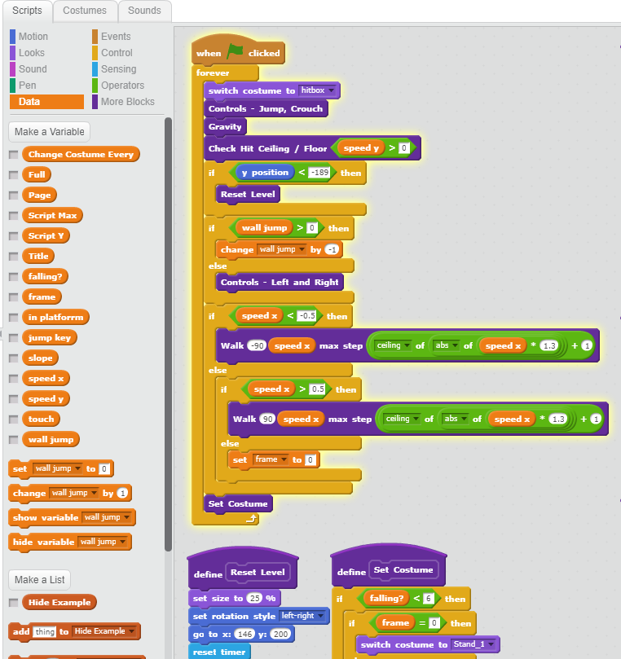
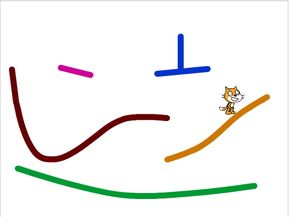

I created this platformer as an anniversary gift for my girlfriend this year. I developed it in Scratch so that I could try to teach her how to code. Scratch is very visually pleasing, and a very beginner-friendly language that any person new to coding could look at and understand. In fact, Scratch was how I first learned how to code.

The picture below shows what the coding process is like when developing in Scratch. There is a menu on the left side which gives you all your "blocks", and on the right side is where you place your blocks. As you can see, it's very easy to follow since the blocks are so brightly colored and things like "if" statements are easily identified.

Admittedly, I did not write most of the code in the project as there was already code out there for platformers using Scratch. Most of my part in the whole developing of this project was the artistic side of the platformer, which including drawing the different sprites for the main character and designing the maps for my girlfriend to play through. Below is an example of the default platformer, without all the artsy stuff yet:

All in all, the project was a fun experience for me and my girlfriend did end up learning something and enjoying it. I have some future projects in mind as well!

Scratch is available as an online editor at https://scratch.mit.edu/, check it out if you are interested.
